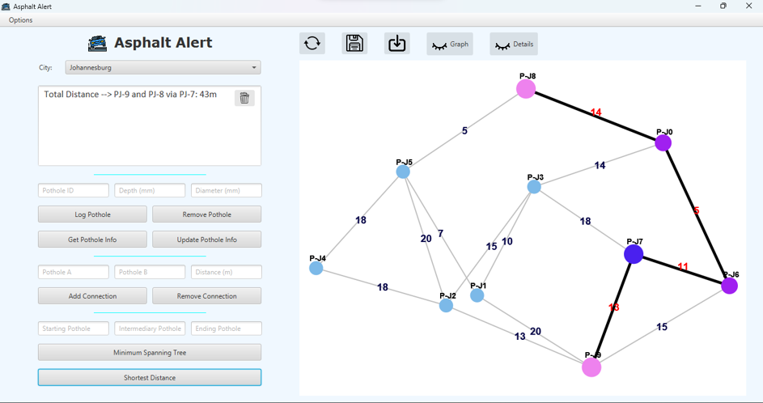

# Asphalt-Alert
This is a pothole management system that allows for logging, updating and deleting pothole data using a Graph.

This was made using [JavaFX](https://openjfx.io/) (for UI) and [GraphStream](https://graphstream-project.org/) (for graph visualisation).

You can view the demo here: https://youtu.be/z0ia-CBIBtg

