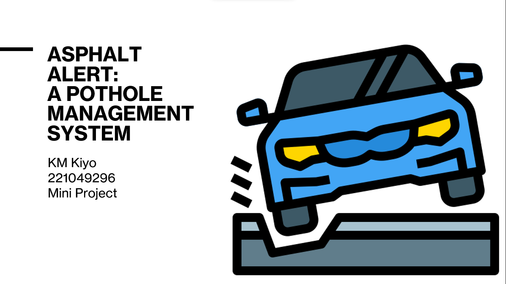

# Asphalt-Alert
This is a pothole management system that allows for logging and deleting potholes using a Graph.

This was made using JavaFX (for UI) and GraphStream (for graph visualisation).

You can view the demo here: https://youtu.be/z0ia-CBIBtg

<!--  -->

